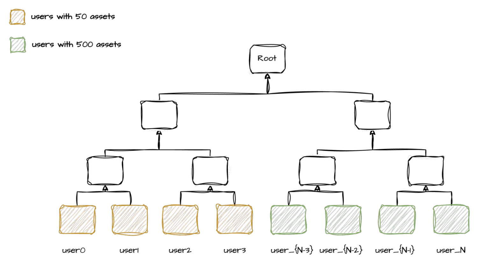

# Updated Proof of solvency for mitigating Dummy user attack

## Background

Previous Proof of solvency design: [https://gusty-radon-13b.notion.site/Proof-of-solvency-61414c3f7c1e46c5baec32b9491b2b3d](https://www.notion.so/Proof-of-solvency-61414c3f7c1e46c5baec32b9491b2b3d?pvs=21).

Enrico Bottazzi, research at the Ethereum Foundation, has reported an alarming phenomenon dubbed the "Dummy User Attack." This attack unfolds as follows: User of this framework has the ability to introduce dummy users whose equity in relatively low-market-cap assets surpass their debts in high-market-cap ones. Such actions are allowed by the current proof-of-solvency design. This manipulation can lead to a precarious scenario wherein User of this framework diminishes the on-chain reserve of high-market-cap assets while inflating that of low-market-cap ones. Consequently, when users seek to withdraw their high-market-cap assets, User of this framework is compelled to liquidate the low-market-cap assets. However, this liquidation may prove unfeasible due to inadequate market liquidity for the low-market-cap assets at times, exacerbating the potential risks for users.

## Updated Proof of solvency protocol

To mitigate the “Dummy user attack”, The updated proof of solvency design introduces a third field, labeled "collateral" within the token configuration for each user. This field denotes the quantity of tokens utilized as collateral for borrowing other assets. Simultaneously, within the global token configuration, fields titled `collateral_ratio_tiers` and `collateral_asset_amount` are introduced, delineating the extent of collateral haircut for the asset involved and the amount of the collateral asset. For further elucidation, refer to the respective [page](https://www.binance.com/en/vip-loan). Under the loan business logic of Binance, this design effectively incorporates three distinct collateral fields catering to various loan businesses: LOAN, COLLATERAL MARGIN, and COLLATERAL PORTFOLIO MARGIN. Consequently, the global token configuration encompasses three categories of collateral ratio tiers and amounts to accommodate these distinctions.

Based on above description, Let’s see a concrete example:

Suppose there are 2 assets (ETH, USDT) and 3 users, and use USDT as the base denominated asset. Assume following user behaviors:

- Alice deposit 10000 USDT to CEX, then use 10000 USDT as LOAN collateral to borrow 2 ETH, and then use 1 ETH as LOAN collateral to borrow 1000 USDT; and swap 1 ETH with Bob's 2000 USDT
- Bob deposit 10 ETH and 10000 USDT to CEX; swap 2000 USDT with Alice's 1 ETH
- Carl deposit 10 ETH to CEX, then use 1 ETH as COLLATERAL MARGIN collateral to borrow 1000 USDT

The user's balance sheet is as following:

|  | ETH (price:2000 USDT) | ETH | ETH  | ETH | ETH | USDT (price: 1 USDT) | USDT | USDT | USDT | USDT | Total Net Balance (USDT) |
| --- | --- | --- | --- | --- | --- | --- | --- | --- | --- | --- | --- |
|  | Equity | Debt | COLLATERAL LOAN | COLLATERAL MARGIN | COLLATERAL PORTFOLIO MARGIN | Equity | Debt | COLLATERAL LOAN | COLLATERAL MARGIN | COLLATERAL PORTFOLIO MARGIN |  |
| Alice | 1 | 2 | 1 | 0 | 0 | 13000 | 1000 | 10000 | 0 | 0 | 10000 |
| Bob | 11 | 0 | 0 | 0 | 0 | 8000 | 0 | 0 | 0 | 0 | 30000 |
| Carl | 10 | 0 | 0 | 1 | 0 | 1000 | 1000 | 0 | 0 | 0 | 20000 |

The token’s configuration is as following:

| Token Symbol | Total Equity | Total Debt | Price | COLLATERAL LOAN amount | COLLATERAL MARGIN amount | COLLATERAL PORTFOLIO MARGIN amount | COLLATERAL LOAN ratio tiers | COLLATERAL MARGIN ratio tiers | COLLATERAL PORTFOLIO MARGIN ratio tiers |
| --- | --- | --- | --- | --- | --- | --- | --- | --- | --- |
| ETH | 22 | 2 | 2000 | 1 | 1 | 0 | [0-1000: 100%, 1000-2000: 90%, …, > 1000000: 0%] | […] | […] |
| USDT | 22000 | 2000 | 1 | 10000 | 0 | 0 | [0-10000: 100%, 10000-20000: 90%, …, > 1000000: 0%] | […] | […] |

*Note: The essence of ratio tiers lies in their values, which are based on USDT as the denominated asset. Consider ETH as an example: "0-1000": 100% signifies that you can utilize 100% of the ETH's USDT value as collateral when the USDT value of ETH is less than or equal to 1000. "1000-2000": 90% indicates that you can use 100% of the ETH value within the 0-1000 range as collateral and 90% of the value within the "1000-2000" range for borrowing purposes.*

The assets CEX holds equal to the summation of every user net asset balance (Equity-Debt). So the CEX needs to hold 20 ETH and 20000 USDT at least.

In proof of solvency, the following properties are guaranteed:

- Each user's collaterals are enough to cover the debts according to the collateral ratio tiers: $\sum_{i \in tokens}{Debt_i} \leq \sum_{ij, i \in tokens, j \in collaterals}{CalcActualAssetValueByRatioTiers(Collateral_{ij})}$;
    - Consider Alice as the example: Her debt is calculated as following: 2(ETH debt)*2000(ETH usdt price) + 1000(USDT debt)*1 = 5000; Her collateral is calculated as following: 1(ETH LOAN collateral)*2000 + 10000(USDT LOAN collateral)*1 = 12000; 12000 > 5000, So Alice can be added into the por proof generation process.
- For each user, Each token’s equity should be equal or bigger than the sum of collaterals: $\sum_{i \in collaterals}{Collateral_i} \leq Equity$;
    - Consider Alice as the example: For ETH token, the collateral amouts is calculated as following: 1+0+0 ≤ 1; For USDT token, 10000+0+0 < 13000.
- Each asset of user is a part of total net asset declared by CEX:
    - For alice, -1 eth is a part of total net eth, and 12000 usdt is a part of total net usdt ;
    - For Bob, 11 eth is a part of total net eth, and 8000 usdt is a part of total net usdt;
    - For Carl, 10 eth is a part of total net eth, and 0 usdt is a part of total net usdt
- the total net asset declared by CEX equals to the summation of every user net asset balance;
- the total collateral asset declared by CEX equals to the summation of every user collateral asset amount

How does the introduced collateral design mitigate the dummy user attack? The global configuration includes ratio tiers and collateral asset amount for each asset. The collateral ratio of low-market-cap assets is low. If User of this framework were to attempt a dummy user attack, it would need to add more low-market-cap assets to replace high-market-cap assets. Users can detect this attack by comparing the ratio between the total collateral asset of low-market-cap assets and the total debt of high-market-cap assets. Additionally, users can verify whether the on-chain reserves of low-market-cap assets can cover the claimed net balance in the asset configuration. If not, it further demonstrates fraudulent behavior by User of this framework.

## Protocol design

### User groups

The users are categorized into different groups based on the number of assets types. The BatchCreateUserOpsCountsTiers contains the categorized parameters used in Binance's proof of solvency. All users are included in a single Merkle tree, as illustrated in the following figure:



### Circuit design
#### Keygen

The circuit supports various user group configurations, enhancing performance. Each user group is associated with a pair of keys (proving key and verifying key). Binance’s proof of solvency generates the following keys:

```
total 31G
-rw-r--r--. 1 root root  12G Sep 18 01:54 zkpor500_92.pk
-rw-r--r--. 1 root root  528 Sep 18 01:54 zkpor500_92.vk
-rw-r--r--. 1 root root 2.8G Sep 18 01:54 zkpor500_92.r1cs
-rw-r--r--. 1 root root  528 Sep 18 02:28 zkpor50_700.vk
-rw-r--r--. 1 root root  12G Sep 18 02:28 zkpor50_700.pk
-rw-r--r--. 1 root root 3.9G Sep 18 02:28 zkpor50_700.r1cs
```

If the prover generates a proof for a user batch with 50 or fewer asset types, it will use zkpor50_700.pk as the proving key. For a user batch with asset types between 51 and 500, the prover will select zkpor500_92.pk to generate the proof. The numbers 700 and 92 represent the batch size in terms of the number of users.

#### Main structures

Compared to previous proof-of-solvency design, The new version introduces the following changes to `CexAssetInfo`, `UserAssetInfo` and `UserAssetMeta`:

```
type CexAssetInfo struct {
    TotalEquity Variable
    TotalDebt   Variable
    BasePrice   Variable

    LoanCollateral            Variable
    MarginCollateral          Variable
    PortfolioMarginCollateral Variable

    LoanRatios            []TierRatio
    MarginRatios          []TierRatio
    PortfolioMarginRatios []TierRatio
}

type UserAssetInfo struct {
	AssetIndex Variable
	LoanCollateralIndex Variable
	LoanCollateralFlag Variable

	MarginCollateralIndex Variable
	MarginCollateralFlag  Variable

	PortfolioMarginCollateralIndex Variable
	PortfolioMarginCollateralFlag  Variable
}

type UserAssetMeta struct {
	Equity                    Variable
	Debt                      Variable
	LoanCollateral            Variable
	MarginCollateral          Variable
	PortfolioMarginCollateral Variable
}
```

- `CexAssetInfo`: Each asset type is associated with a `CexAssetInfo`

    - `LoanCollateral/MarginCollateral/PortfolioMarginCollateral`: These represent the total collateral value of all users for a specific asset;
    
    - `LoanRatios/MarginRatios/PortfolioMarginRatios`: These represent the collateral haircut configurations for a specific asset which are used to calculate the real collateral value

- `UserAssetMeta`: To easier update `CexAssetInfo` in the circuit, every possible asset type (now Binance's circuit support 500 assets at most) is associated with a `UserAssetMeta`;

- `UserAssetInfo`: Depending on the different user groups, the number of `UserAssetInfo` instances varies for each user. For example, if a user belongs to the group of 50 asset types, there will be 50 `UserAssetInfo` entries for that user.

`CreateUserOperation` encompasses all the information needed to determine whether this user can be added to the Merkle tree:

```
type CreateUserOperation struct {
	BeforeAccountTreeRoot Variable
	AfterAccountTreeRoot  Variable
	Assets                []UserAssetInfo
	AssetsForUpdateCex    []UserAssetMeta
	AccountIndex          Variable
	AccountIdHash         Variable
	AccountProof          [utils.AccountTreeDepth]Variable
}
```

#### Circuit Constraints

The new Binance's proof-of-solvency upgraded the underlying gnark library and utilized two notable features: range check and lookup. 

The main constraints are as follows:

- All assets values are properly range checked;

- Each user's collateral must be sufficient to cover their debts according to the collateral ratio tiers:
    
    - Iterate over the assets in `CreateUserOperation`:
        - Use lookup technology to find the corresponding `UserAssetMeta` from `AssetsForUpdateCex` based on `AssetIndex`;

        - Use lookup technology to find the corresponding `LoanRatios/MarginRatios/PortfolioMarginCollateral` from `CexAssetInfo` based on `AssetIndex`;

        - Calculate the actual collateral value based on `UserAssetMeta` and haircut ratios
    
    - Sum the actual collateral values of all assets and compare this total with the user's debt value.

- For each user, the equity of each token should be equal to or greater than the total collateral:

    - Iterate over the assets in `CreateUserOperation`:

        - Use lookup technology to find the corresponding `UserAssetMeta` from `AssetsForUpdateCex` based on `AssetIndex`;

        - Sum the collateral values from `UserAssetMeta` and compare this total with the user's equity value

- For each asset, `CexAssetInfo` is constructed from the data of all users:

    - `TotalEquity` is the sum of the `equity` values of all users;

    - `TotalDebt` is the sum of the `debt` values of all users;

    - `LoanCollateral/MarginCollateral/PortfolioMarginCollateral` is the total collateral value of all users

- For each user, ensure consistency between `AssetsForUpdateCex` and the `Assets` fields. In other words, the `Assets` must contain all non-empty asset information from `AssetsForUpdateCex`. Binance's proof-of-solvency employs a novel method to address this:

    - Generate a random number, `randomChallenge`, from all the circuit inputs;

    - Construct a lookup table of powers of `randomChallenge`;

    - Create a random linear combination of `Assets` and `AssetsForUpdateCex`; if the results are the same, it proves that `Assets` contains all non-empty asset information from `AssetsForUpdateCex`

- The user merkle tree must be constructed correctly:

    - For a newly added user, first prove their non-existence in the Merkle tree, then update the Merkle root based on the user account hash and the previously used Merkle proof

### Circuit performance analysis
#### Constraints number

The total number of basic constraints (excluding any users) is 6,574,804.
- For users in the group of 50 asset types: each user adds 82,494 constraints. The 2^26 constraints accommodate approximately 730 users. To be conservative, Binance has chosen 700 as the number of users per batch.
- For users in the group of 500 asset types: each user adds 622,241 constraints. The 2^26 constraints accommodate around 97 users. To be conservative, Binance has selected 92 as the number of users per batch.

#### Proof cost

On the m5.8xlarge AWS server, generating proof for one batch takes 62 seconds, and verifying the proof takes approximately 3 milliseconds. The spot instance of m5.8xlarge costs $0.5166 per hour. Based on this, a user with 50 or fewer asset types incurs a cost of $0.0000127, while a user with 51 to 500 asset types costs $0.000097.